# 幻兽学院 使用说明书

> 让班级积分管理变成一场有趣的幻兽养成冒险！

---

## 目录

1. [产品简介](#产品简介)
2. [快速上手](#快速上手)
3. [班级主页 — 日常核心操作](#班级主页)
4. [光荣榜 — 学生排名展示](#光荣榜)
5. [小卖部 — 积分兑换奖励](#小卖部)
6. [成长记录 — 数据分析中心](#成长记录)
7. [老师设置 — 配置中心](#老师设置)
8. [幻兽图鉴 — 查看所有幻兽](#幻兽图鉴)
9. [分享给家长](#分享给家长)
10. [安装到桌面](#安装到桌面)
11. [常见问题 FAQ](#常见问题)

---

## 产品简介

**幻兽学院**是一款专为小学老师打造的**游戏化班级积分管理工具**。

核心理念很简单：**学生表现好 → 老师加分 → 幻兽成长进化 → 收集更多幻兽**。

把传统的积分表变成了一场养成冒险，学生们会为了让自己的幻兽升级而更加努力！

### 双积分体系

幻兽学院有两套积分，各有用途：

| 积分类型 | 用途 | 说明 |
|---------|------|------|
| **成长值** | 喂养幻兽、升级进化 | 领养新幻兽后会重置为 0 |
| **可用积分** | 在小卖部兑换奖励 | 兑换商品后扣减 |
| **累计积分** | 光荣榜排名依据 | 只增不减，历史总获得 |

> 简单理解：加分时三个积分同时增加；兑换商品只扣「可用积分」；换新幻兽只重置「成长值」。

### 幻兽进化阶段

每只幻兽有 5 个成长阶段，随着成长值提升自动进化：

| 等级 | 形态 | 说明 |
|------|------|------|
| Lv.1-2 | 🥚 蛋 | 刚领养时的初始形态 |
| Lv.3-4 | 👶 幼年 | 破壳而出，萌萌的幼崽 |
| Lv.5-6 | 🧒 少年 | 开始成长，初具特色 |
| Lv.7-8 | 💪 成年 | 威风凛凛的成熟形态 |
| Lv.9-10 | 👑 究极 | 最终进化，满级收集！ |

---

## 快速上手

从零开始使用幻兽学院，只需 6 步：

### 第 1 步：注册账号

打开幻兽学院网址，点击「注册」标签：
- 输入**用户名**（6位以上，字母/数字/下划线）
- 输入**密码**（6位以上）
- 点击「立即注册」

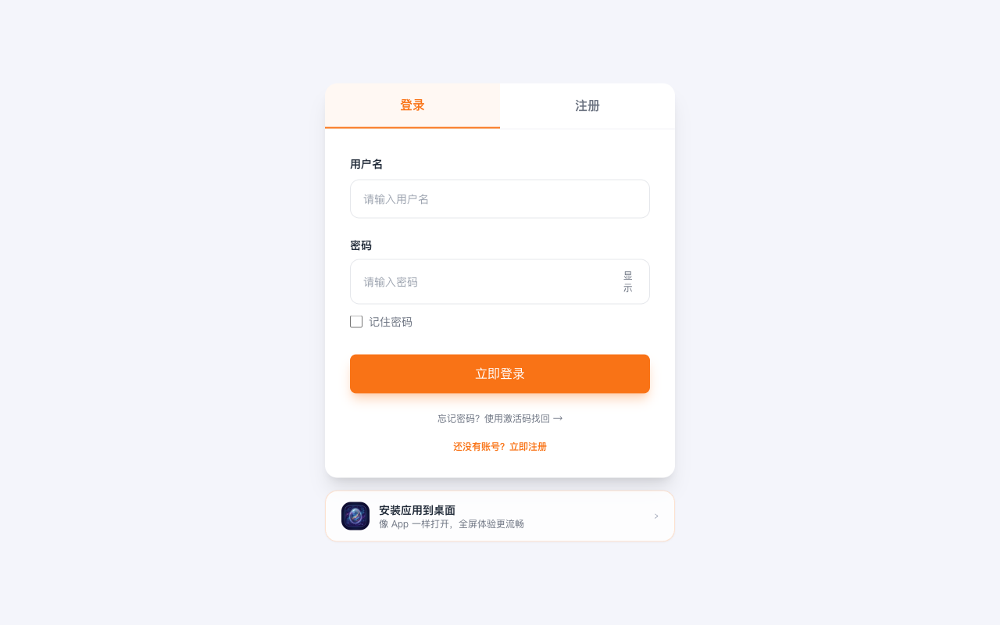

### 第 2 步：激活账号

注册后需要使用**激活码**激活账号：
- 将购买的 6 位激活码粘贴到输入框
- 点击「立即激活」
- 激活成功后自动登录

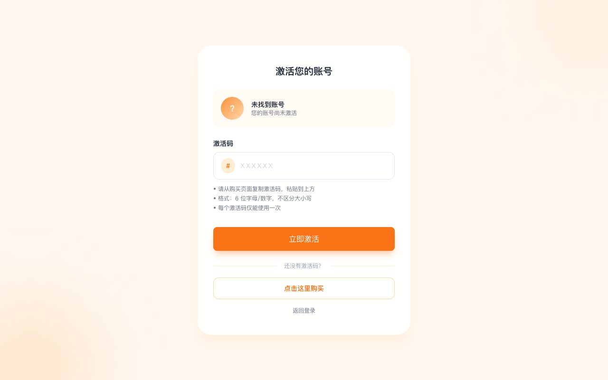

> 激活码格式为 6 位字母/数字，不区分大小写，每个激活码仅能使用一次。

### 第 3 步：创建班级

登录后进入「老师设置」→「班级管理」：
- 点击「新建班级」
- 输入班级名称（如"三年三班"）
- 可选择「默认模板」或「从已有班级复制设置」

### 第 4 步：添加学生

在「老师设置」→「学生管理」中添加学生，支持三种方式：
- **单个添加**：输入姓名，点击「添加」
- **批量添加**：在文本框中一行一个姓名或用逗号分隔，点击「批量添加」
- **Excel 导入**：点击「Excel 导入」上传名单文件

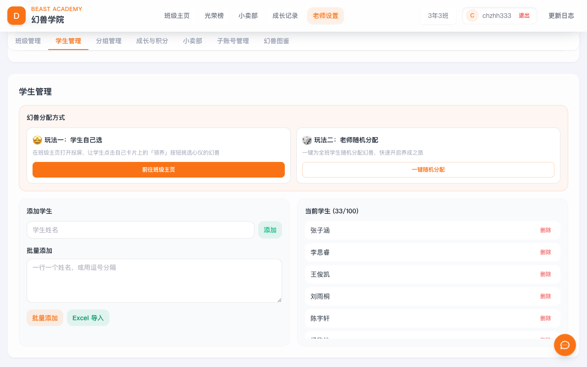

> 每个班级最多支持 100 名学生。

### 第 5 步：分配幻兽

有两种有趣的玩法：
- **玩法一：学生自己选** — 在班级主页打开投屏，让学生点击自己卡片上的「领养」按钮，挑选心仪的幻兽
- **玩法二：老师随机分配** — 点击「一键随机分配」，系统为全班学生随机分配幻兽

### 第 6 步：开始打分！

回到班级主页，点击学生卡片即可加分/扣分，幻兽就开始成长了！

---

## 班级主页

班级主页是你日常使用最多的页面，所有的打分操作都在这里完成。

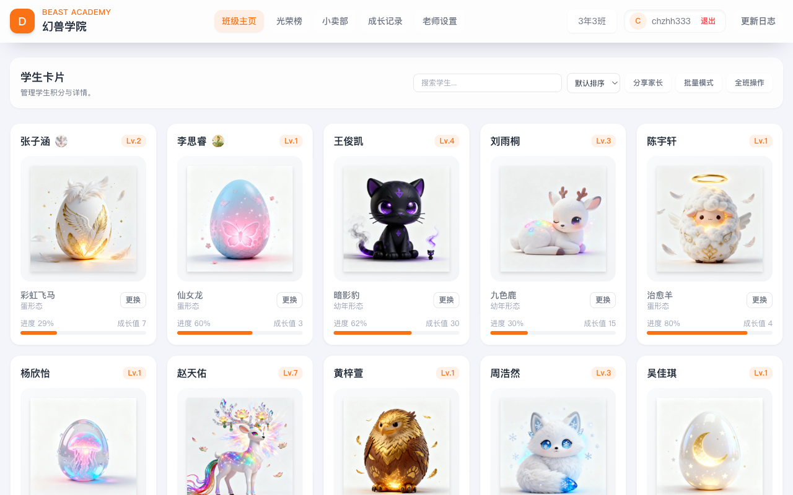

### 学生卡片

每张卡片展示学生的关键信息：
- **姓名**和**等级**（如 Lv.4）
- **幻兽图片**和**形态名**（如"暗影豹 · 幼年形态"）
- **成长进度条**和**成长值**
- **已收集徽章**（满级后出现，代表已收集的幻兽）

### 给学生打分

**单个学生打分：**
1. 点击学生的卡片
2. 弹出「加分喂养」面板，显示所有积分规则
3. 选择「加分」或「扣分」标签
4. 点击对应的规则（如「作业优秀 +3」），立即生效

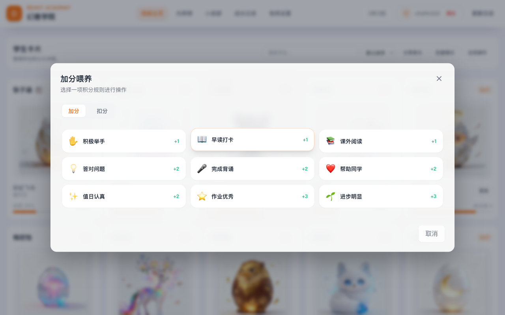

**批量打分：**
1. 点击右上角「批量模式」
2. 点击学生卡片勾选（或在搜索框输入多个姓名，用空格分隔，再点击「选中」）
3. 底部会显示已选人数
4. 点击「批量喂养」，选择积分规则，为选中的学生统一加分/扣分

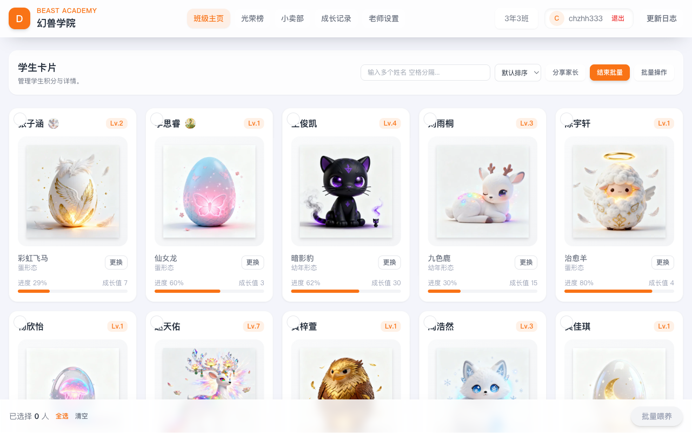

**全班操作：**
- 点击「全班操作」→ 选择规则 → 全班同学一起加分（如早读打卡 +1）

### 撤回功能

打分后 **3 秒内**，底部会弹出撤回条，点击「撤回」即可取消刚才的操作。操作失误也不用担心！

### 领养/更换幻兽

- 点击学生卡片上的「领养」或「更换」按钮
- 在弹出的幻兽列表中，可按「全部」「梦幻系」「热血系」筛选
- 点击想要的幻兽即可完成领养

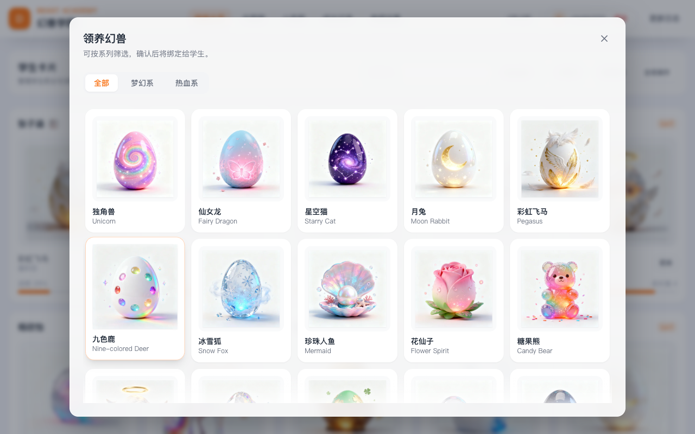

> 共有 31 只幻兽可选：梦幻系 16 只（独角兽、仙女龙、星空猫等）+ 热血系 15 只（霸王龙、雷狼、机甲龙等）。

### 满级收集机制

当学生的幻兽达到 **Lv.10 满级**时：
1. 屏幕上会出现进化庆祝动画
2. 当前幻兽自动加入「已收集」列表，获得一枚徽章
3. 学生可以领养一只新幻兽，成长值重置为 0，重新开始养成之旅
4. 收集越多幻兽，徽章越多，排名越靠前！

### 搜索和排序

- **搜索**：在搜索框输入学生姓名快速定位
- **排序**：支持「默认排序」「按姓名」「按积分」三种排序

### 投屏使用建议

班级主页非常适合投屏到教室大屏幕：
- 学生可以实时看到自己幻兽的成长
- 加分时有喂养动画，进化时有庆祝特效
- 建议使用大图模式，卡片更大更清晰

---

## 光荣榜

光荣榜展示全班学生的积分排名，激励学习竞争。

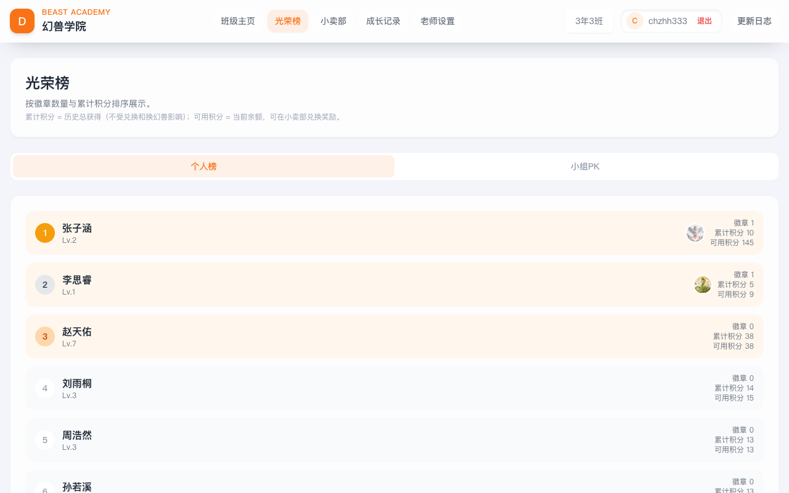

### 个人榜

- 按**徽章数量**优先，其次按**累计积分**排序
- 前三名用金色、银色、铜色高亮显示
- 每位学生显示：等级、徽章数、累计积分、可用积分

### 小组 PK 榜

如果你在设置中创建了小组，光荣榜会多出「小组PK」标签：
- 按小组总积分排名
- 显示每个小组的人数、总积分、人均积分
- 点击可展开查看小组成员

---

## 小卖部

小卖部是学生用「可用积分」兑换奖励的地方，让积分真正有价值！

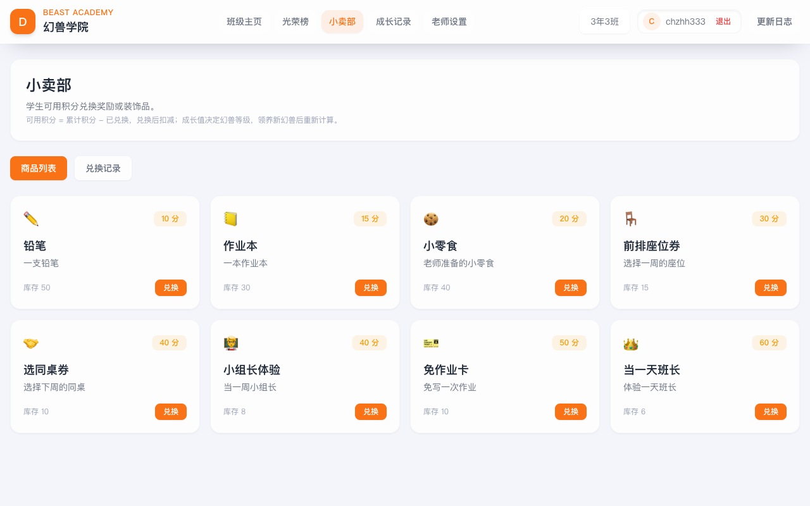

### 兑换流程

1. 在小卖部页面查看商品列表（每个商品显示名称、价格、库存）
2. 点击商品旁的「兑换」按钮
3. 在弹窗中选择要兑换的学生
4. 系统自动检查学生的可用积分是否足够
5. 确认后扣减可用积分，库存 -1

### 兑换记录

点击「兑换记录」标签，查看所有历史兑换记录，包括学生姓名、商品、时间、扣除积分。

### 默认商品

系统预设了 8 种商品（可在设置中自定义）：

| 商品 | 价格 | 说明 |
|------|------|------|
| ✏️ 铅笔 | 10 分 | 一支铅笔 |
| 📒 作业本 | 15 分 | 一本作业本 |
| 🍪 小零食 | 20 分 | 老师准备的小零食 |
| 🪑 前排座位券 | 30 分 | 选择一周的座位 |
| 🤝 选同桌券 | 40 分 | 选择下周的同桌 |
| 🧑‍🏫 小组长体验 | 40 分 | 当一周小组长 |
| 🎫 免作业卡 | 50 分 | 免写一次作业 |
| 👑 当一天班长 | 60 分 | 体验一天班长 |

---

## 成长记录

成长记录是班级的数据分析中心，帮你了解积分使用情况。

### 明细记录

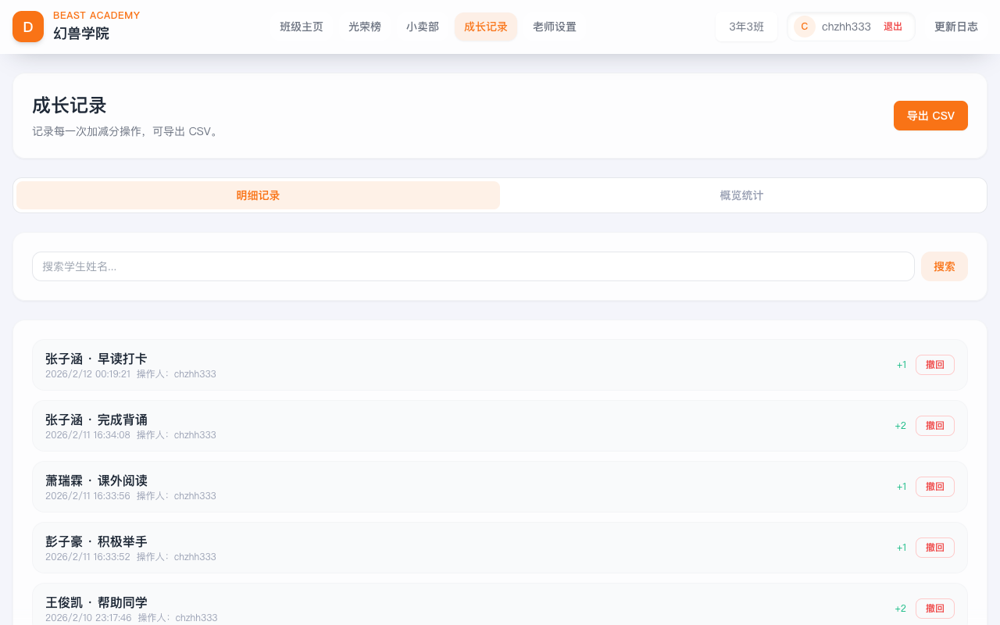

- 按时间倒序展示所有加减分记录
- 每条记录显示：学生姓名、规则名称、分值（+/-）、操作时间、操作人
- 支持按学生姓名**搜索**
- 未撤回的记录可以点击「撤回」取消
- 点击右上角「导出 CSV」可导出全部记录到表格文件

### 概览统计

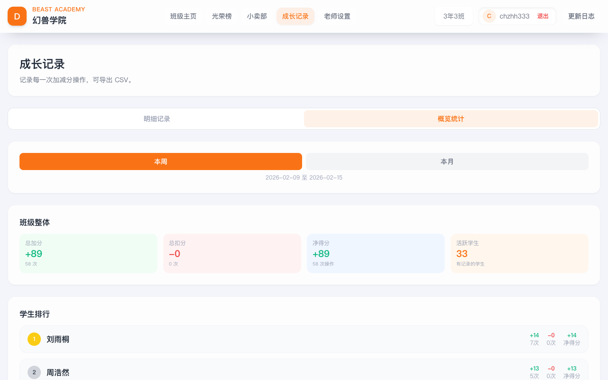

切换到「概览统计」标签，可查看数据分析：

**时间范围**：可切换「本周」或「本月」

**班级整体**：
- 总加分、总扣分、净得分
- 操作次数、活跃学生数

**学生排行**：
- 按净得分排序，前三名金银铜色高亮
- 每位学生显示加分、扣分、净得分明细

**规则统计**：
- 每条积分规则的使用次数和总分数
- 帮助你了解哪些规则最常用，优化班规设计

---

## 老师设置

设置页面是班级的配置中心，包含 6 个子模块。

> 注意：只有主账号可以访问设置页面，子账号无权访问。

### 班级管理

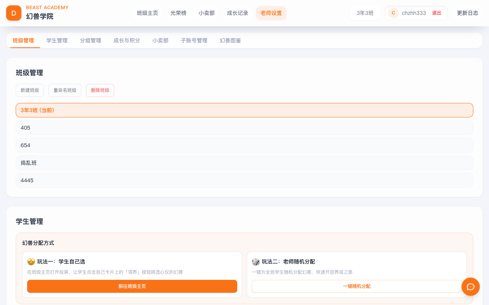

- **新建班级**：支持「默认模板」或「从已有班级复制」
- **重命名班级**：修改班级名称
- **删除班级**：删除后该班级的所有数据（学生、记录等）都会被清除，请谨慎操作
- **切换班级**：点击班级名称即可切换，也可在顶部导航栏的班级按钮快速切换

### 学生管理

**添加学生**：
- 单个添加：输入姓名点击「添加」
- 批量添加：在文本框输入多个姓名（一行一个或逗号分隔），点击「批量添加」
- Excel 导入：点击「Excel 导入」上传名单

**幻兽分配**：
- 玩法一：投屏班级主页，让学生自己点击卡片领养
- 玩法二：点击「一键随机分配」为全班随机分配

**删除学生**：点击学生右侧的「删除」按钮（需二次确认）

### 分组管理

创建小组进行积分 PK：
- 点击「新建小组」创建小组
- 为小组命名、选择颜色、添加成员
- 小组积分 = 成员累计积分之和
- 在光荣榜可查看小组排名

### 成长与积分

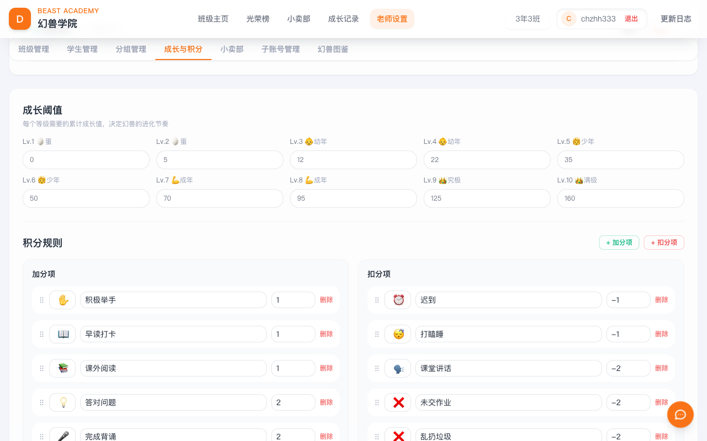

**成长阈值**：
- 配置 Lv.1 到 Lv.10 每个等级需要的成长值
- 默认值为：0、5、12、22、35、50、70、95、125、160
- 你可以根据班级情况调整进化节奏

**积分规则**：
- 分为「加分项」和「扣分项」两组
- 每条规则包含：图标、名称、分值
- 可新增、删除、修改规则
- 支持拖拽排序（决定打分弹窗中的显示顺序）
- 修改后自动保存，无需手动点击保存按钮

### 小卖部商品

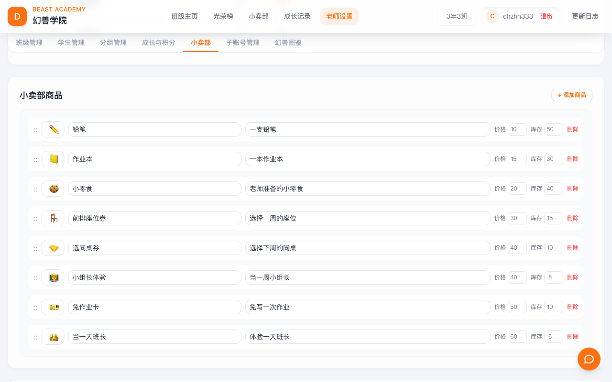

- 添加/编辑/删除商品
- 每个商品包含：图标、名称、描述、价格、库存
- 支持拖拽排序
- 修改后自动保存

### 子账号管理

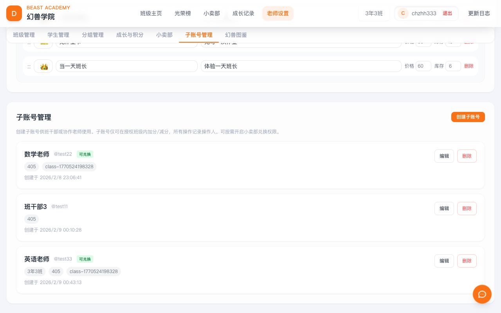

子账号适合给班干部或协作老师使用：

**创建子账号**：
- 设置用户名、密码、昵称
- 选择可访问的班级（可多选）
- 设置是否允许兑换商品

**子账号权限**：
- 可以在授权班级内加分/扣分
- 所有操作会记录操作人姓名
- 默认不能兑换商品（可在设置中开启）
- 不能访问设置页面

---

## 幻兽图鉴

幻兽图鉴展示所有可领养的幻兽及其 5 个进化形态。

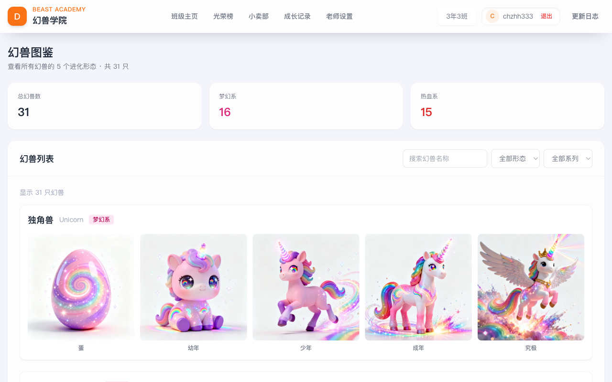

- 共 31 只幻兽：梦幻系 16 只 + 热血系 15 只
- 可按系列筛选：全部 / 梦幻系 / 热血系
- 可按形态筛选：蛋 / 幼年 / 少年 / 成年 / 究极
- 支持搜索幻兽名称（中英文均可）
- 每只幻兽展示从蛋到究极的 5 个形态图片

---

## 分享给家长

你可以生成分享链接发给家长，让家长实时看到孩子的幻兽成长状态。

### 如何分享

1. 在班级主页点击「分享家长」按钮
2. 选择分享类型：
   - **班级分享**：家长可看到全班同学的幻兽和排名
   - **学生分享**：家长只能看到自己孩子的详细数据
3. 生成链接后，复制发送给家长即可

### 家长看到什么

**班级分享**：全班学生的幻兽卡片、等级、进度，前三名带金银铜勋章

**学生详情**：
- 幻兽大图和等级进度
- 徽章数、累计积分、可用积分
- 已收集的幻兽列表
- 最近 10 条积分记录

> 分享链接无需登录即可查看，方便家长随时查看。

---

## 安装到桌面

幻兽学院支持安装到桌面，像原生 App 一样使用，全屏体验更流畅。

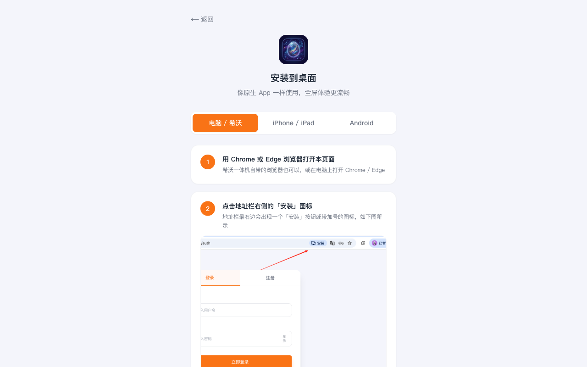

### 电脑 / 希沃一体机

1. 用 Chrome 或 Edge 浏览器打开幻兽学院
2. 点击地址栏右侧的「安装」图标
3. 确认安装即可

### iPhone / iPad

1. 用 Safari 浏览器打开幻兽学院
2. 点击底部分享按钮
3. 选择「添加到主屏幕」

### Android

1. 用 Chrome 浏览器打开幻兽学院
2. 点击右上角菜单
3. 选择「添加到主屏幕」

---

## 常见问题

### 忘记密码怎么办？

在登录页面点击「忘记密码？使用激活码找回」，输入用户名和激活码即可重置密码。

### 学生满级后怎么办？

幻兽达到 Lv.10 满级后，学生可以领养一只新幻兽。旧幻兽会加入「已收集」列表，获得一枚徽章。成长值重置为 0，重新开始养成，形成收集循环。

### 「可用积分」和「成长值」有什么区别？

- **成长值**决定幻兽等级和进化，领养新幻兽后清零
- **可用积分**用来在小卖部兑换商品，兑换后扣减
- **累计积分**是历史总获得积分，不受兑换和换幻兽影响

### 子账号能做什么？不能做什么？

**能做**：在授权班级内给学生加分/扣分
**选择性开启**：小卖部兑换权限
**不能做**：修改设置、管理学生、创建班级、管理子账号

### 一个老师可以管理多个班级吗？

可以！在设置中创建多个班级，通过顶部导航栏的班级按钮随时切换。每个班级有独立的学生、规则、商品和记录。

### 数据会丢失吗？

所有数据存储在云端，更换设备登录同一账号即可看到全部数据。

### 扣分会导致幻兽降级吗？

不会。成长值最低为 0，不会降到负数。扣分会减少可用积分，但不会影响已有的等级。

### 这是一个 App 吗？

幻兽学院是一个网页应用（PWA），不需要在应用商店下载。直接用浏览器打开网址就能使用，支持电脑、希沃一体机、手机、平板等所有设备。而且可以「安装到桌面」，安装后体验跟原生 App 一模一样，全屏运行、没有地址栏，具体操作见「安装到桌面」章节。

### 手机能访问吗？

可以！幻兽学院已针对手机做了适配，用手机浏览器打开网址即可使用。推荐将网页「添加到主屏幕」，方便日常快速打开。iPhone 用 Safari，Android 用 Chrome 效果最佳。

### 学生在喂养期间可以换养吗？

可以。在班级主页点击学生卡片上的「更换」按钮，就能重新选择一只新幻兽。喂养期间更换幻兽，成长值、等级、积分都保持不变，只是换了一个幻兽外观。只有满级（Lv.10）后领养新幻兽时，成长值才会重置为 0。

### 幻兽学院会自动更新吗？

会。幻兽学院是网页应用，所有更新都在服务器端完成，你无需手动下载或安装任何东西。每次打开网页时，自动加载最新版本。如果你已经「安装到桌面」，也会自动获取更新，不需要重新安装。

---

> 如有更多问题，欢迎联系客服获取帮助。祝你和学生们在幻兽学院玩得开心！
